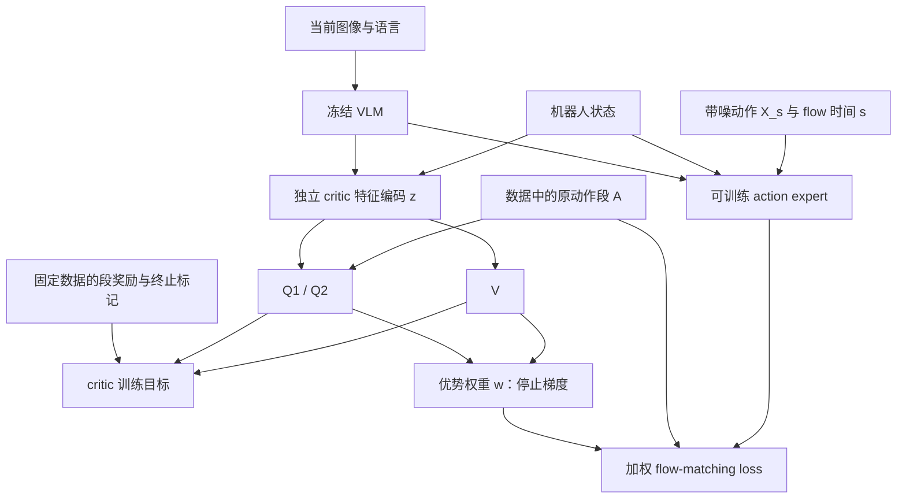
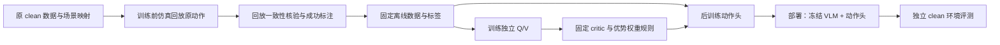

# 冻结 VLM 的 VLA 离线 RL 后训练方案

版本：v0.3 讨论稿，数据与交互范围已确认，已补充模型框架与数学目标。日期：2026-10-01。

本文记录已经确认的研究边界、数据核验结果和推荐实验路线。尚未实现训练器，也未开展仿真、训练或环境评测。训练前仅回放 clean 原动作来补齐成功标签；不使用冻结 SFT 策略生成训练轨迹。H/K、初始化 checkpoint 和 pilot 任务仍需在实施阶段确认。

## 1. 目标与已确认约束

首阶段在 RoboTwin clean 环境验证离线 RL 后训练能否提高现有 SFT 策略的实际成功率，再考虑扩展至 randomized 环境。

- 允许训练前在仿真中回放 clean 原动作，生成成功标签，随后固定训练数据与标签版本。
- reward 只读取已固定的数据集结果；RL 更新期间不在线调用环境判断成功，不用模型生成伪成功标签。
- 不执行冻结 SFT 策略来生成训练数据，不新增模型 rollout 或人为扰动的失败样本。
- 冻结视觉语言主干；允许更新 action expert，并训练独立 Q/V 网络。
- 允许与环境交互做独立评测；评测轨迹与结果不回灌训练集、reward 或 critic。
- 部署仍通过动作生成模块输出动作，第一版移除辅助 Q/V 网络。

环境评测用于开发阶段模型选择时，必须另外保留未用于选择的最终评测种子。本文是独立研究方案，不改变现有 clean SFT 入口及其数据边界。

## 2. 数据调查：官方包与“现成成功标签”的差异

官方 RoboTwin 文档说明，数据生成先寻找能成功完成任务的种子，再录制示范；官方采集代码只保存通过成功检查的轨迹。因而 clean 示范的默认来源是成功专家轨迹，不能假设同时包含失败示范。[官方采集说明](https://robotwin-platform.github.io/doc/usage/collect-data.html)、[官方采集代码](https://github.com/RoboTwin-Platform/RoboTwin/blob/main/scripts/collect_data.py)。

本次进一步读取了官方 Hugging Face 包的元数据和全部动作 Parquet 表的 footer：

| 项目 | 核验结果 |
|---|---|
| 数据仓库 | `TianxingChen/RoboTwin2.0` |
| 固定 revision | `981c92aa34d8f94d4cff47e0d5bc2f7d4e0af042` |
| 文件 | `lerobot_dataset/RoboTwin_lerobot_v30.zip` |
| episode / frame | 2,500 / 548,893 |
| 记录 FPS | 15；不能据此直接假设模拟器控制频率也是 15 Hz |
| 动作表 | 25 份，共 548,893 行 |
| 动作表顶层列 | state、action、timestamp、frame_index、episode_index、index、task_index |
| episode 元数据 | 3 份，分别为 1,000、1,000、500 条 |
| success / reward / done 等字段 | schema 与 episode 元数据中均未发现 |

`info.json` 及三份 episode 元数据的 SHA256 均与项目已有的 `clean_training/norm_verification.json` 一致。详情见 [本次核验记录](offline_rl_dataset_audit.json)。固定版本的官方文件见 [数据包目录](https://huggingface.co/datasets/TianxingChen/RoboTwin2.0/tree/981c92aa34d8f94d4cff47e0d5bc2f7d4e0af042/lerobot_dataset)。

这项核验没有重新检查全部数值或视频，也没有检查用户可能持有的额外标签清单。它确认的是对应官方导出包的字段；不能据此否定另一份转换数据或外部标注文件。

实施前须对齐成功标签的字段或清单路径、任务与 episode 对应关系、标签取值及缺失比例。官方包缺少标签，可以通过已获授权的训练前仿真补齐。`task_index` 在该包中对应语言任务表，不能直接将 `total_tasks=2411` 当作语义任务数，也不能按语言索引替代 50 个任务的分层统计。

### 训练前仿真生成：仅回放原示范动作

| 方式 | 动作来源 | 标签对应对象 | 对离线 RL 的意义 |
|---|---|---|---|
| 回放原 clean 示范 | 原数据的专家动作 | 成功复现且时序匹配的示范；状态偏离时保存诊断，原 episode 标签标为未验证 | 补齐结果，验证回放链路；通常仍以成功为主 |
| 冻结 SFT 策略执行 | 模型在当前观测下真实输出的动作 | 新生成的完整模型轨迹 | 已排除，不作为本方案的训练数据来源 |

回放与标签写入均在 actor/critic 训练启动前结束。RL 训练器只读数据，不持有环境接口。冻结 SFT 策略可以在独立评测中执行，但其评测轨迹与结果不用于后训练。

仿真需要恢复任务、物体初始状态及随机种子。官方 LeRobot 表里的图像与 14 维机器人状态不足以唯一恢复完整场景，episode_index 也不是场景 seed。应从原始数据的 seed/scene 元数据建立映射，并固定环境、资产、机器人控制器与动作时序版本。原始映射不可取得时，不能直接在另一个 clean 随机场景回放并把结果贴给原轨迹；需先恢复原始映射。当前范围不包含替代场景生成。

回放失败要先排除场景恢复、控制频率、绝对/相对动作及执行器接口错误，不能把工具链错误当成可用的任务失败。每条回放需要记录观测与状态偏差的诊断；只有足够忠实复现原轨迹的结果才作为原 episode 标签。回放偏离后的结果属于实际回放过程，不能硬贴给原数据；这类 episode 标为未验证并从首版 RL 排除，不静默替换为新的训练轨迹。

标签清单至少包含原数据版本、语义任务名、原 episode_index、场景 seed 或状态快照标识、环境版本、动作时序、success、replay_valid 与异常原因。先选择少量 episode 通过回放一致性验证，再批量标注。原始 clean 数据不覆盖写入，标签与诊断单独保存。

### 数据准入与算法预期

- 有现成成功/失败标签：读取原标签，不改变语义；检查每个任务的正负样本覆盖。
- 有现成标签但全部为成功：可以做探索性价值学习，但不预设能够学会失败规避或恢复。
- 官方包外有标签清单：显式关联原 episode，保存来源与哈希，不从文件名或转换成功日志推断结果。
- 没有现成标签：通过训练前仿真生成结果并写入版本化标签；不把“来源是成功示范”当作已经读取到了成功字段。
- 标签缺失、结果未知、记录被截断：不作为失败样本参与首版 RL。

若全为成功，终端奖励且 gamma=1 的理想数据内价值可能接近常数，优势权重会趋近于普通 BC。gamma<1 能产生完成时间差异，但这不是新的失败信号；不同状态下剩余时长不同，也不能直接证明 critic 学会了比较同一状态下的不同动作。

## 3. 模型更新范围

项目已有 `train_expert_only`，但它主要冻结 `qwenvl`，不能替代完整参数审计。

| 模块 | 建议 |
|---|---|
| Qwen3-VL 视觉与语言主干 | 冻结参数，保持 eval 模式 |
| 当前/未来感知 query、prefix 侧投影与辅助感知头 | 冻结；保留推理需要的 token、连接与注意力结构 |
| depth/video teacher | 不训练；首版不计算其辅助训练 loss |
| Qwen action expert、动作侧 MoE | 训练；保留必要的路由正则与监控 |
| action_in_proj、action_out_proj、时间条件模块 | 训练 |
| state_proj | 建议训练，明确列入动作侧白名单 |
| 独立 Q1/Q2/V 及其特征投影 | 训练 |

不通过直接清空 `align_params` 删除 prefix query，因为这可能改变初始化模型的动作条件。冻结模块的参数和持久 buffer 都需要保持不变；动作 MoE 的路由状态更新单独记录。

训练前输出可训练参数列表与规模，确保 optimizer 只包含白名单。冻结 VLM 可减少反向计算，但其前向成本仍存在。

## 4. 推荐算法：IQL 风格价值学习 + 优势加权 flow matching

IQL 在价值更新中使用数据内动作，并通过优势加权行为克隆提取策略。本项目保留这一价值学习思路，将策略目标改为优势加权的现有 `L1_fm`。这是需要验证的适配，不声称与原论文的概率策略提取严格等价。[IQL 论文](https://arxiv.org/abs/2110.06169)。

### 符号与模型框架

| 符号 | 含义 |
|---|---|
| t / s | t 是轨迹中的控制转移索引；s 是 flow 插值时间，两者不同 |
| I_t / ell / p_t | 当前多视角图像、语言指令、机器人状态 |
| omega_0 / theta | 冻结 VLM 参数 / 可训练动作生成模块参数 |
| z_t / chi | critic 观测特征 / 独立 critic 特征编码器参数 |
| phi_1、phi_2 / psi | 双 Q 网络参数 / V 网络参数 |
| H / K / k | 预测 horizon / 每次执行长度 / 样本的实际有效长度 |
| tau / beta | expectile 参数 / 优势权重温度 |
| sg | stop-gradient，只传递数值，不传递梯度 |

定义当前观测和冻结的视觉语言条件：

$$
o_t=(I_t,\ell,p_t),\qquad
h_t=F_{\omega_0}(I_t,\ell),\qquad
\omega_0\ \text{固定}.
$$

动作支路沿用原模型的条件 token/KV 和机器人状态，学习速度场；critic 支路拥有独立的观测编码：

$$
v_\theta(X_s,s;h_t,p_t),\qquad
z_t=g_\chi\bigl(\operatorname{pool}(\operatorname{sg}[h_t]),p_t\bigr).
$$

$$
Q_{\phi_1}(z_t,A_t),\quad Q_{\phi_2}(z_t,A_t),\quad V_\psi(z_t).
$$

pool 表示待确定的 token 聚合方式。这里的 h 是视觉语言条件的概念表示，不要求将动作支路原有的逐层条件替换为单个池化向量；pool 仅用于独立 critic。

图中的 critic 目标使用当前特征、真实后继特征与 target Q；为保持清晰，未展开其双时间分支。先训练 critic，再固定 chi、phi_1、phi_2、psi 及权重尺度训练 actor。权重支路不反向更新 critic，actor loss 也不更新 VLM。

数据生成、训练和评测的边界如下：

评测输出不返回离线训练数据或 reward。部署保留 flow 动作生成和重规划，移除 Q/V。

### 冻结观测特征与独立 critic

以当前图像、语言和机器人状态构成观测 x。冻结 VLM 提取视觉语言 token，独立投影或池化后，与归一化的原始机器人状态组成 critic 输入 z。

- Q1/Q2 输入 z 和真实动作段 A；V 仅输入 z。
- critic 不复用正在更新的 action expert 或 state_proj 输出。
- 标签、episode ID、未来真实图像和真实剩余完成步数不作为输入。
- 当前观测可能不是完整 Markov 状态，首版将其作为近似；必要时再消融可在线取得的短历史。
- 固定图像预处理时可缓存 critic 特征。首版不把逐层 VLM KV 全量存盘作为默认方案。

### 动作段与终端目标

建议首版预测长度 H 与执行长度 K 一致，候选值 H=K=10，作为待验证配置，不直接改现有 50 步 SFT 默认值。

从轨迹构造离线动作段转移：

$$
A_t=(a_t,\ldots,a_{t+k-1}),\qquad 1\le k\le K,
$$

$$
\mathcal D=\left\{
(z_t,A_t,R_t^{(k)},z_{t+k},d_t,k,M_t)
\right\}.
$$

k 为有效转移数，通常为 K，末段可以更短；d_t 是该段的真实终止标记，M_t 是动作有效位置 mask。须先核验数据中 action 是当前控制命令、下一状态目标还是复制的终端占位；不能仅按数组位置假设动作与后继观测对齐。

对包含 T 个有效动作转移的完整 episode，回放结果为 y_e：

$$
y_e\in\{0,1\},\qquad
r_t=
\begin{cases}
y_e,&t=T-1,\\
0,&0\le t<T-1.
\end{cases}
$$

成功为 1，失败为 0；不添加步数惩罚、距离奖励或伪标签。段奖励为：

$$
R_t^{(k)}=\sum_{j=0}^{k-1}\gamma_{\mathrm{step}}^{j}r_{t+j}.
$$

双 Q 的 Bellman 目标和损失为：

$$
b_t=R_t^{(k)}+
\gamma_{\mathrm{step}}^k(1-d_t)
\operatorname{sg}\bigl[V_\psi(z_{t+k})\bigr],
$$

$$
L_Q=\sum_{i=1}^{2}\mathbb E_{\mathcal D}
\left[\left(Q_{\phi_i}(z_t,A_t)-b_t\right)^2\right].
$$

terminal 段的 bootstrap 为零，即使没有终端下一图像也不伪造后继观测。padding 不增加 k，不重复奖励，不进入 critic 动作编码的有效部分。非 terminal 段必须有真实后继。

### V 的 expectile 回归与优势权重

Q target network 使用 EMA，其参数记为 bar(phi_i)。双 Q 的保守估计为：

$$
\bar Q(z,A)=\min_{i=1,2}Q_{\bar\phi_i}(z,A).
$$

V 使用上 expectile 回归，tau 大于 0.5 时更偏向数据中的较高价值动作：

$$
\delta=\operatorname{sg}[\bar Q(z,A)]-V_\psi(z),
$$

$$
L_V=\mathbb E_{\mathcal D}
\left[\left|\tau-\mathbf 1_{\{\delta<0\}}\right|\delta^2\right],
\qquad \tau>0.5.
$$

这里没有对动作头新生成的动作进行价值查询，价值更新仅使用数据中的动作。优势及其训练权重为：

$$
\operatorname{Adv}(z,A)=
\operatorname{sg}\bigl[\bar Q(z,A)-V_\psi(z)\bigr],
$$

$$
w(z,A)=\min\left\{
w_{\max},\exp\left(\frac{\operatorname{Adv}(z,A)}{\beta}\right)
\right\},\qquad \beta>0.
$$

Adv 衡量该状态下数据动作相对于价值基准的优势。beta 越小，权重对优势差异越敏感；w_max 限制少数样本的影响。

温度先用训练集的优势尺度选择，随后固定。对 log-weight 先做数值截断，再计算指数。避免按每个小 batch 的标准差放大接近零的优势；也避免依赖 batch 内重新归一化导致 micro batch=1 时全部权重退化为 1。记录权重分位数、截断比例和有效样本量 `ESS=(sum w)^2/sum(w^2)`。

### 动作头目标

保留现有噪声、时间采样和 `L1_fm`，仅改变 loss 的样本权重。与当前代码一致，flow 时间 s 从噪声端 1 走向动作端 0：

$$
\epsilon\sim\mathcal N(0,I),\qquad
X_s=s\epsilon+(1-s)A,\qquad u_s=\epsilon-A.
$$

动作头 v_theta 预测速度 u_s。对每个样本，先按有效时间与有效动作维度计算平均 loss：

$$
\ell_{\mathrm{FM}}=
\frac{\displaystyle\sum_{j,d}M_{j,d}
\left|v_\theta(X_s,s;h,p)_{j,d}-(\epsilon-A)_{j,d}\right|}
{\displaystyle\sum_{j,d}M_{j,d}}.
$$

仅使用至少存在一个有效动作位置的样本。M 排除尾部 padding 和无效动作维度；j 是动作段内的位置，d 是动作维度索引。actor 总目标为：

$$
\boxed{
L_{\mathrm{actor}}=
\mathbb E_{\mathcal D}[w(z,A)\ell_{\mathrm{FM}}]
+\lambda_{\mathrm{demo}}
\mathbb E_{\mathcal D_{\mathrm{demo}}}[\ell_{\mathrm{FM}}]
+\lambda_{\mathrm{MoE}}L_{\mathrm{MoE}}
}
$$

三项分别表示优势加权更新、普通示范约束和动作侧 MoE 正则。L_MoE 是路由平衡等项的聚合简写，实现时沿用各项自身系数；不能误把它们重复加权。期望也包含原模型的噪声与 flow 时间采样。

原代码在部分入口使用全 batch 的有效元素平均，此处定义的是先计算单样本均值再加权。因此普通 BC 对照需要使用相同归约方式；末段长度不同时，w=1 不一定与原代码的全局元素平均数值相等。

首版分阶段优化：先对 chi、phi_1、phi_2、psi 优化 L_Q 与 L_V，再固定 critic，仅对 theta 优化 L_actor；不将三个 loss 无区别地联合反向更新整个 VLA。

weight 停止梯度；动作侧 MoE 正则单独加到总目标，不把所有辅助 loss 乘同一权重。沿用 55 维 canonical action 的有效维度 mask，不能把填充维度当作真实机器人动作。

推理时从 X_1=epsilon 开始积分速度场，得到 X_0 作为动作段：

$$
\frac{\mathrm dX_s}{\mathrm ds}=v_\theta(X_s,s;h,p),\qquad
X_1=\epsilon,\qquad \hat A=X_0.
$$

数值积分沿 s 从 1 到 0 进行，步长为负。策略依然是原 flow 动作生成方式，推理不计算优势权重，也不需要 Q/V。

H=K 的目的是避免把短执行段的优势归因到长预测段。后续若恢复 H=50、K=10，需要另外设计边缘策略的训练和归因，不能直接用前 10 步的优势加权整段 50 步，也不能把未执行预测当成环境标签。

Flow Q-Learning 作为后续备选，其原始方案引入额外的单步策略，改变最终输出路径，不作为首版默认实现。[FQL 作者说明](https://seohong.me/projects/fql/)。

## 5. 奖励与折扣的实验解释

唯一奖励来源保持为训练启动前已经固定的成功标签，包括训练前仿真生成的结果。折扣定义必须注明按“数据转移步”还是“策略决策段”，不可混用。

gamma_step=1 对应不偏好快慢的成功回报；若数据全成功，预计价值差异可能很小。gamma_step<1 对更早成功有偏好；需根据轨迹持续时间与真实控制步的对应关系选择，避免机械照搬 0.99。可以用时间半衰期表示候选折扣，但不能直接把记录 FPS 当控制 Hz。

在全成功、gamma_step=1 且拟合充分的理想数据内情形，有可能出现：

$$
Q(z,A)\approx1,\qquad V(z)\approx1
\quad\Longrightarrow\quad
\operatorname{Adv}(z,A)\approx0,\quad w(z,A)\approx1.
$$

此时优势加权项退化为普通 FM 训练，RL 没有提供明显的新信号。对于 gamma_step<1 的成功轨迹，第 t 个转移的实际回报为：

$$
G_t=\sum_{j=0}^{T-1-t}\gamma_{\mathrm{step}}^j r_{t+j}
=\gamma_{\mathrm{step}}^{T-1-t}.
$$

该式是数据轨迹的 Monte Carlo 回报，不是声称 IQL 的 Q 在所有动作上都等于此值。它显示标签可产生完成时间差异，却不能单独证明在同一状态下能够区分动作优劣。

首版报告须同时展示成功率和成功 episode 的执行步数。没有提升时，不通过奖励重定义或评测回灌追求正结果。全成功条件下，critic 的轨迹记忆或噪声也可能造成不合理权重，应优先查看权重稳定性及实际评测。

## 6. 实验阶段与对照

### A. 数据与初始化审计

确认原动作回放、场景恢复映射、标签来源、完整性、每任务标签分布、动作时序、episode 边界及归一化。通过 replay_valid 的回放结果按实际成功/失败保留；工具链异常、时序或场景不匹配与结果未知单独标识，不作为失败。

原场景回放映射、开发评测种子、最终评测种子分别保存。标注完成后冻结数据与标签；开发与最终评测轨迹不回灌。初始化使用经过评测、可追溯的 SFT checkpoint；加载同一运行的 normalization contract，重新创建 optimizer/scheduler。

按完整 episode 划分 critic 训练与验证，禁止相邻帧或重叠动作段跨集合。记录初始化 SFT 是否已见过验证 episode，不能把这样的 critic 验证集称为全链路未见数据。

### B. 先验证相同 horizon 的普通 BC

确认 H=K=10 对模型、编译算子、数据统计切片和部署接口的支持。原 H=50 模型在 K=10 下的结果仅作为参考；主要 RL 对照采用相同 H/K 的普通动作头 SFT，消除 horizon 与重规划差异。

### C. 独立训练 critic

先训练双 Q/V，必要时用标签导出的 Monte Carlo 回报做初始化。检查留出 episode 的价值误差、与已知回报的一致性、Q1/Q2 分歧、优势与权重稳定性。无负标签时不报告成功/失败分类能力。

通过诊断后固定 critic 与权重尺度，进行小预算 actor pilot。不要因为 critic loss 降低就认定可以改进策略。若全成功数据下权重接近常数，或重复训练得到的优势不稳定，不人为放大差异；记录该结果并优先与普通 BC、return-weighted FM 对照。

### D. 动作头后训练与对照

| 组别 | 用途 |
|---|---|
| 原 SFT checkpoint，记录原 H/K | 原始参考 |
| 固定 VLM、相同 H/K、同数据及更新预算的普通动作头 SFT | 主要对照 |
| IQL critic + 优势加权 FM + 示范约束 | 研究方案 |
| 标签导出的 return-weighted FM 或打乱优势权重 | 检查收益是否来自 critic，而非简单时间权重或随机重加权 |

若含失败数据，再加入仅成功数据的普通 SFT 对照；若全成功，此对照与原数据 BC 重复，不额外训练。

先选 3—5 个原模型有提升空间的 clean 任务，覆盖不同技能，并在 RL 结果出现前固定选择依据。候选包括堆叠、精确放置和双臂交接；不预设这些任务当前成功率较低。pilot 有稳定趋势后扩展至全部 50 个语义任务。

## 7. 环境评测与成功判据

- 在 `demo_clean` 下评测真实成功率；环境成功判断仅用于评测。
- 各组保持相同环境版本、任务配置、种子集合、语言设置、控制接口、H/K 和数值精度；H/K 不同的原模型结果单独标识。
- 主实验建议每任务 100 个评测 episode，至少 3 个训练随机种子；pilot 可以缩小，但不能据此宣称最终胜出。
- 记录每 episode 的初始种子、结果、动作采样种子、执行步数、延迟、任务配置与 checkpoint。
- 报告每任务成功率、任务等权平均和相对 BC 的变化；配对场景比较并给出不确定性，不只挑最好的单次模型。
- 开发评测用于选 checkpoint；最终评测使用独立固定种子集。
- 主要判据为在匹配条件下可靠提高实际成功率；Q 值、FM loss 和离线动作误差只是诊断。

如果权重接近常数，或效果只达到普通 BC，应如实得出“现有成功标签未提供足够有效的策略改进信号”。这仍是有价值的研究结论，不通过生成失败标签、修改原轨迹或回灌评测数据弥补。

## 8. 项目落地位置与必要验证

建议后续实现为独立扩展 `extensions/offline_rl/`，按数据适配、冻结特征、critic、actor 目标及训练入口组织。配置位于 `configs/vla/robotwin/`，训练产物位于 `outputs/train_outputs/`，评测位于 `outputs/eval_outputs/`。这是规划目录，目前未创建实现。

优先复用现有图像处理、动作归一化、episode 边界和 action mask；新增离线转移适配，不把当前监督数据 loader 直接当成完整 RL replay。

运行保存数据与标签哈希、split、场景与种子映射、回放一致性记录、仿真版本、初始化 checkpoint、可训练参数名单、H/K、奖励和折扣定义、critic/actor 配置及评测协议。既有 normalization snapshot 不因补标签或后训练自动重算。

实现后需要验证：

1. 标签与 episode 一一关联，缺失值不变成失败。
2. reward 只在真实终端转移出现一次；段奖励与 gamma^k 正确。
3. 转移不跨 episode，padding 与 terminal 后继处理正确。
4. 权重为 1 时 actor 目标恢复定义一致的普通样本平均 FM 目标。
5. 冻结主干、query 与 buffer 在更新后不变，动作侧有有效梯度。
6. 成功标签和真实未来信息未进入观测特征。
7. 部署移除 critic 后，归一化与动作接口兼容。

## 9. 当前决定与待对齐项

### 实现现状

| 部分 | 当前状态 |
|---|---|
| VLM + flow-matching action expert | 已有模型实现 |
| 主干冻结开关、动作维度与尾部 loss mask | 已有基础；尚需完整参数与 buffer 审计 |
| clean 原动作回放、场景恢复与成功标签 | 尚未实施 |
| 动作段 RL 数据适配 | 尚未实现 |
| 独立双 Q/V、expectile 与优势权重 | 尚未实现 |
| 加权 FM 后训练入口 | 尚未实现 |
| clean 成功率对照实验 | 尚未开展 |

本稿中的图和公式是设计目标，不表示上述新模块已在仓库中实现。

### 已确认范围与待验证配置

已确认：clean 先验证；训练前仅回放 clean 原动作来生成并固定成功标签；不生成模型训练 rollout，不人为构造失败；RL 更新时只读取固定数据；VLM 冻结，action expert 与独立 Q/V 可训练；允许独立环境评测，评测结果不回灌训练。

推荐但尚未实测：双 Q/V 的 IQL 风格价值学习；固定 critic 后优势加权 `L1_fm`；示范约束；首版 H=K=10 与相同设置的 BC 对照。

实施前最关键的待对齐项：原始场景映射和回放动作时序能否恢复。随后确定初始化 SFT checkpoint、pilot 任务及 H/K。回放标签可能几乎全为成功，因此首版定位为“成功示范上的价值加权后训练探索”，不能宣称具备模型失败恢复数据覆盖。当前稿不承诺提升，不启动仿真或训练，也不改动已有训练入口。
